# PixelQuest

# Highlights

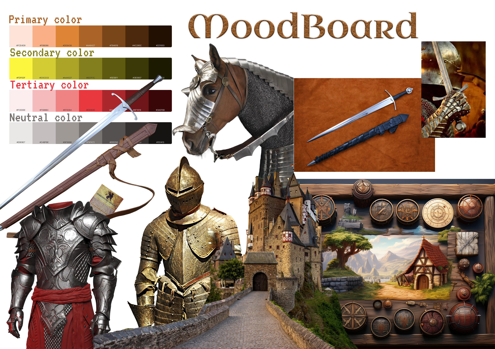

- Multiple artworks created in [Piskel](https://www.piskelapp.com/) and [GIMP](https://www.gimp.org/)following a medieval theme depicting objects, locations and characters
- A skillfully created Moodboard detailing the general vibe and color plaettes
# Overview

Created for LaPlateforme_ in Marseille, this art project aims to develop the artistic skills of students in the immersive systems and video games course as they transition from the coding and development phase of the course towards the artistic creation phase, which is evident in immersive experiences and video games

## Artists

- Eltigani ABDALLAH
- Olivier PORTAL
- Laurent CASSAR

# Gallery

 

 
Pixel art

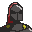

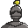

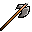

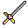

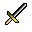

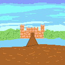

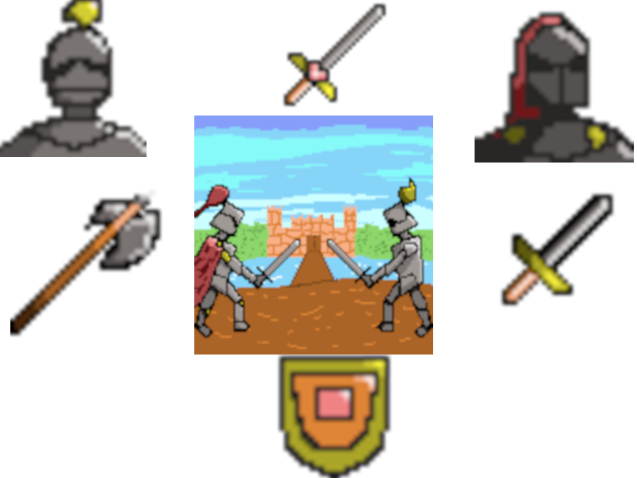

 GIMP art 

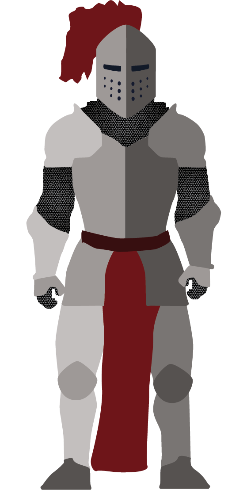

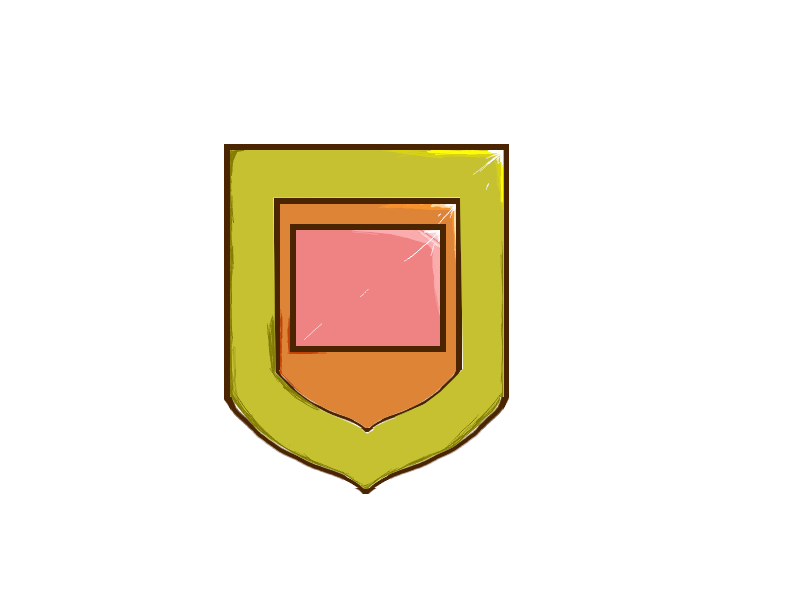

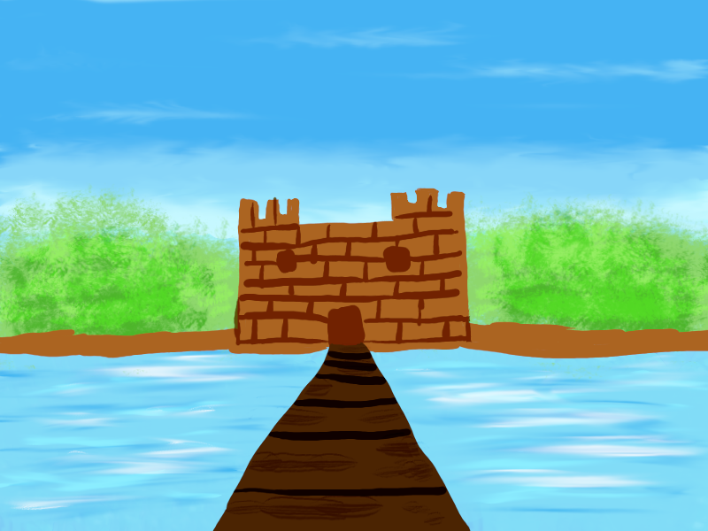

